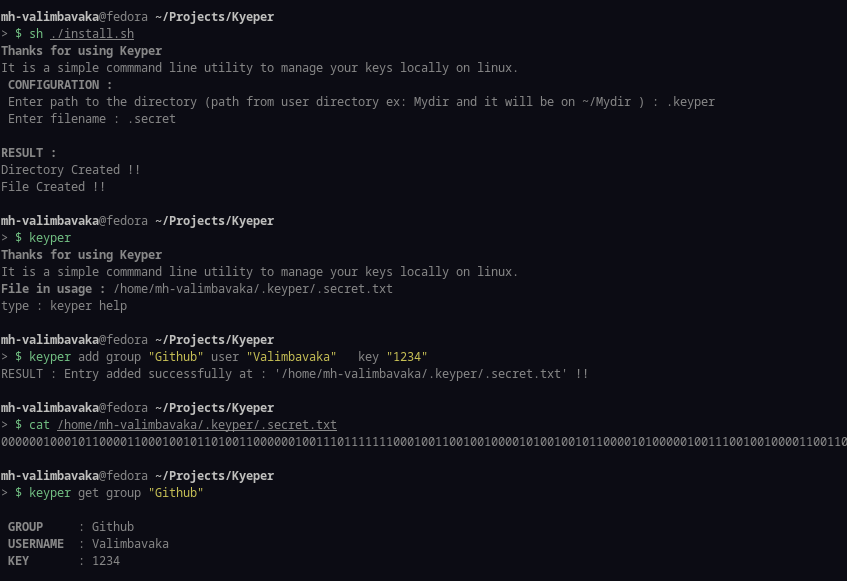
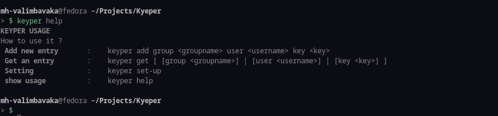

```
____________Howdy !!
This is a bit of code I did in C++ for my free time and for my personal usage, it aims to keep some keys in a **regular file**.

I just used xor encryption, and converted all character into a binary string to avoid someone to watch the content of the file.
Just hope my IT friend wouldn't be too curious.

Maybe I'll improve it or not!

_________Instructions
I made it for me, However if you are interested...

#1 .make sure you have g++ installed.

#2 .just execute the install.sh.


## Demo
```




