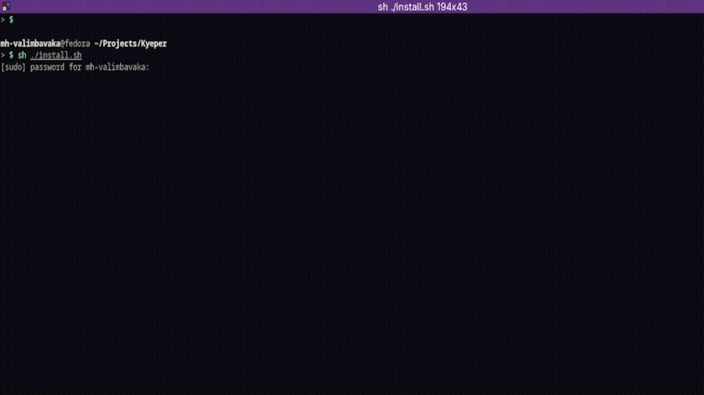
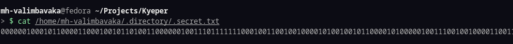

# Howdy !!
This is a repository for my personal CLI-tool.

I felt the need to create a tool to store my keys on my local computer.

it can perform basic tasks sush as : adding, removing, getting the stored keys.

For a simple security measurement , I used XORencryption and converted all strings into a binary number sequences(Yes nothing more).

## Instructions
I made it for me, However if you are interested...

- make sure you have g++ installed.

- just execute the install.sh.
```bash
sh ./install.sh
```

## Demo



The content can' t be shown directly

